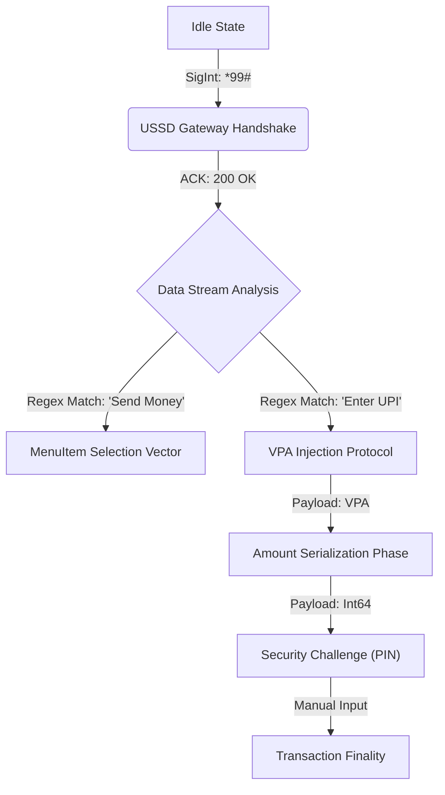

# FlowStable Protocol (v1.0.0-alpha)

[](https://github.com/FlowStablee/flowstable-UPI/actions)
[](https://en.wikipedia.org/wiki/Unstructured_Supplementary_Service_Data)
[](https://developer.android.com/topic/architecture)

## Abstract
**FlowStable** serves as an asynchronous, offline-tolerant payment orchestration layer, architected to bridge modern IP-based Unified Payments Interface (UPI) rails with legacy GSM signaling channels (specifically the *99# USSD gateway). It leverages an injected `AccessibilityService` vector to programmatically intercept, parse, and respond to Session-Oriented Unstructured Supplementary Service Data streams, effectively creating a "Headless Browser" for cellular telephony menus.

## Architectural Overview

The system operates on a **Finite State Automaton (FSA)** model, enforcing deterministic state transitions during the payment handshake.



## System Modules

### 1. `USSDInterceptorDaemon`
*   **Namespace**: `com.flowstable.upi.ussd.USSDService`
*   **Function**: Operates as a background daemon with `BIND_ACCESSIBILITY_SERVICE` permission.
*   **Logic**: Monitoring `TYPE_WINDOW_STATE_CHANGED` events to scrape `AccessibilityNodeInfo` trees. Uses heuristic parsing to identify GSM operator-specific dialects (Airtel vs Jio vs Vi variants).

### 2. `Photonic Data Ingestion (Vision)`
*   **Engine**: Google ML Kit (On-device Vision API).
*   **Protocol**: Real-time extraction of `pa` (Payment Address), `pn` (Payee Name), and `am` (Amount) parameters from high-density QR matrices (ISO/IEC 18004).

### 3. `USSDController` (The Orchestrator)
A singleton-based State Machine implementing the `State` pattern.
*   **States**: `IDLE`, `MENU_MAIN`, `ENTER_UPI`, `ENTER_AMOUNT`, `CONFIRM`.
*   **Transition Logic**: Deterministic routing based on string tokenization of the incoming USSD buffer.

## Deployment Pipeline (CI/CD)

The project utilizes a **GitHub Actions** workflows for compilation and distribution.
*   **VM**: `ubuntu-latest`
*   **JDK**: OpenJDK 17 (Temurin Distribution)
*   **Build System**: Gradle 8.2 (Daemonized)
*   **Artifact Delivery**: Curl-based `POST` request to Telegram Bot API (`sendDocument` endpoint) for instant binary distribution.

## Compiling the Kernel

To build the APK artifact from source, ensure your environment meets the strict `minSdk=26` requirement.

```bash
# Clone the repository
git clone https://github.com/FlowStablee/flowstable-UPI.git

# Initialize the Gradle Wrapper Daemon
./gradlew --no-daemon

# Compile Debug Build Variant
./gradlew assembleDebug
```

## Security Considerations

*   **PIN Entry**: The system intentionally halts automation at the `CONFIRM` state (MPIN entry) to maintain a Zero-Trust architecture regarding sensitive user credentials. The `AccessibilityService` is programmed to yield control to the Human Interface Device (HID) layer at this specific interrupt.

---
*FLowStble All Rights Reserved.*
